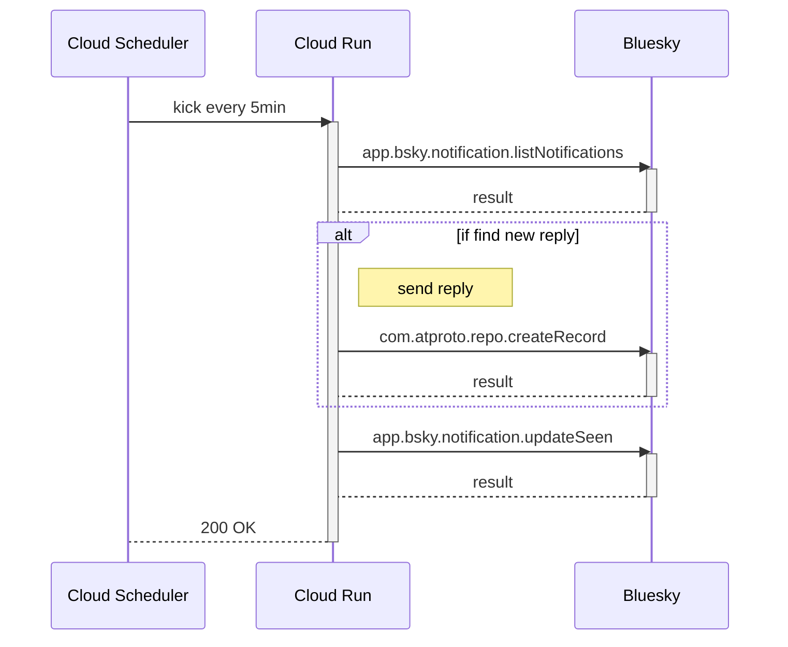

# dicebot (bot) living on Bluesky

[@dice.fauxtrots.com](https://bsky.app/profile/dice.fauxtrots.com)

## Usage

### roll dice

```text
@dice.fauxtrots.com 1d6
```

Bot responds with a random value.

```text
1d6: 5
```

### roll multiple dice

```text
@dice.fauxtrots.com 2d6 1d12
```

Bot responds with a multiple random values.

```text
2d6: 4 3 = 7
1d12: 12
```

## How does it work?

A simplified process flow is shown below.


